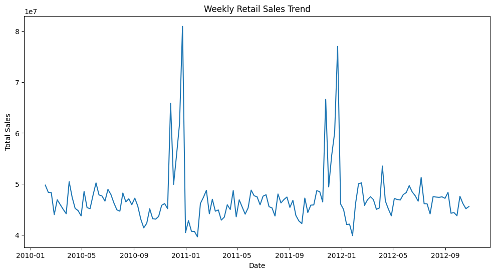
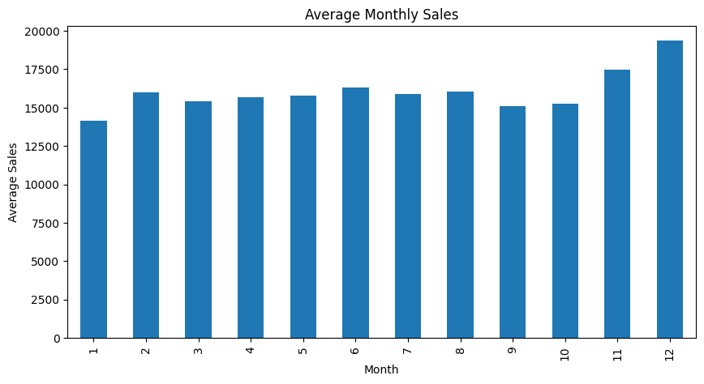
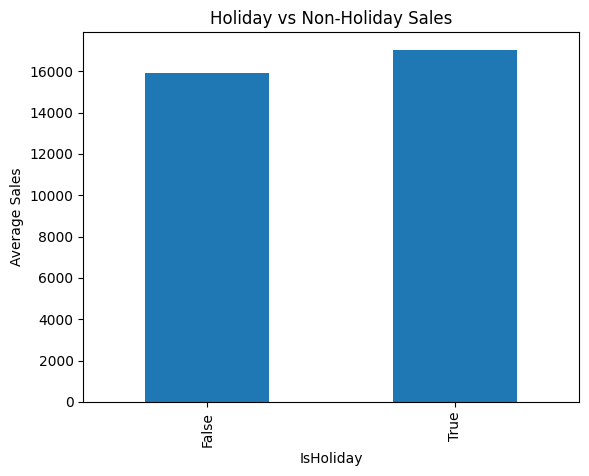
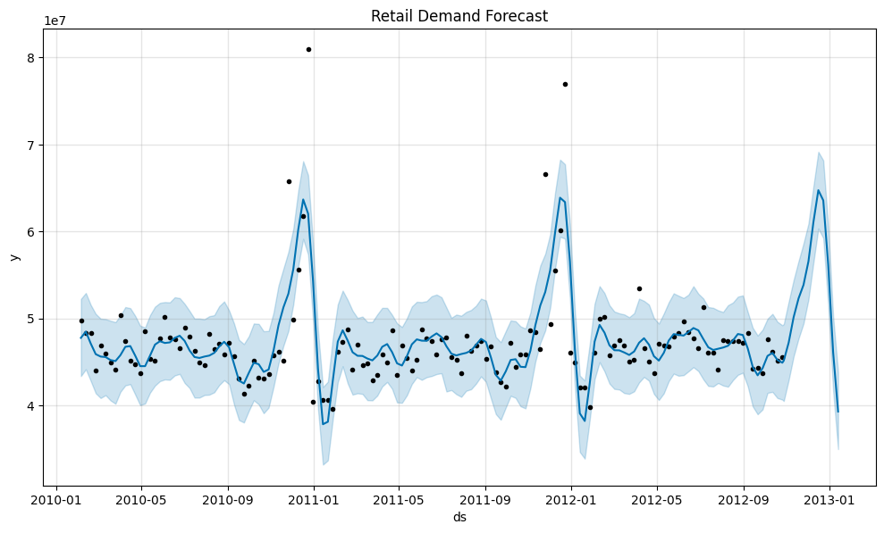

# Retail Demand Forecasting & Inventory Planning

## Project Overview
Retail companies must forecast product demand accurately to optimise inventory planning and avoid stock shortages or excess inventory. This project analyses Walmart retail sales data to identify demand patterns and forecast future sales.

## Dataset
The dataset contains historical weekly retail sales across multiple Walmart stores and departments.

Key variables include:
- Store ID
- Department ID
- Date
- Weekly Sales
- Holiday indicator

## Analysis Performed
The following analyses were conducted:

- Exploratory Data Analysis
- Seasonal Demand Analysis
- Holiday Sales Comparison
- Store Performance Analysis
- Demand Forecasting using Prophet

## Tools Used
- Python
- Pandas
- Matplotlib
- Seaborn
- Prophet

## Key Insights
- Retail sales show seasonal demand patterns across different months.
- Sales tend to increase during holiday periods.
- Some stores generate significantly higher sales than others.
- Demand forecasting helps retailers anticipate future sales and improve inventory planning.

## Project Files
- `retail_demand_forecasting.ipynb` – main analysis notebook
- `train.csv` – dataset
- Visualisation charts for analysis results

## Key Visualisations

### Weekly Retail Sales Trend

### Average Monthly Sales

### Holiday vs Non-Holiday Sales

### Retail Demand Forecast

